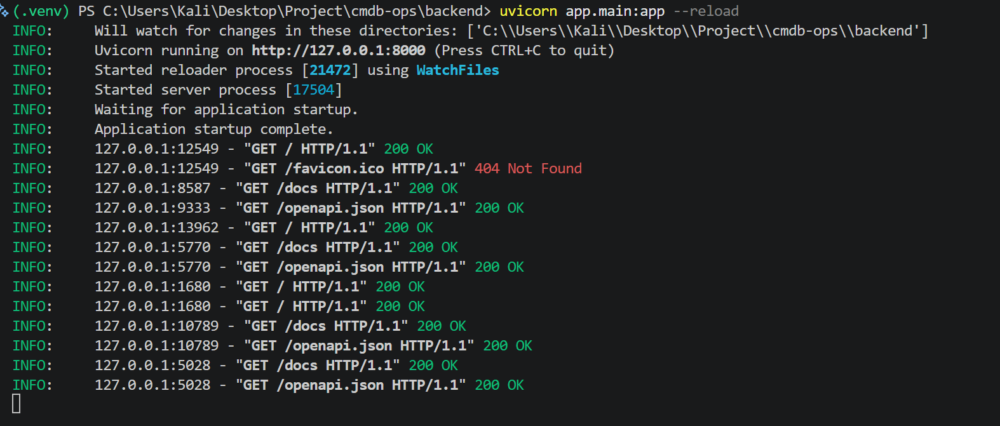
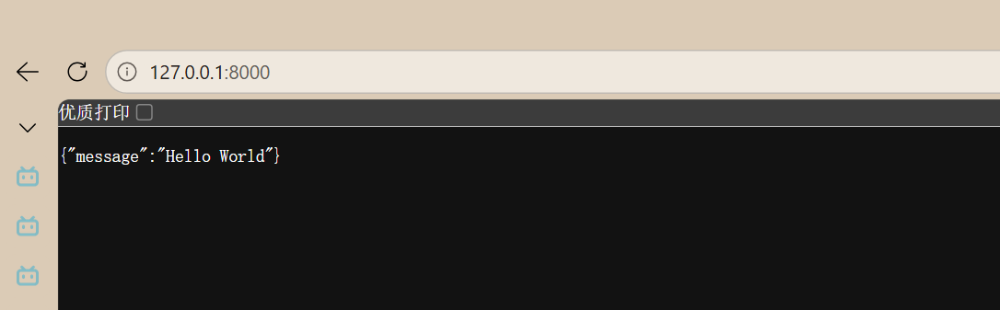
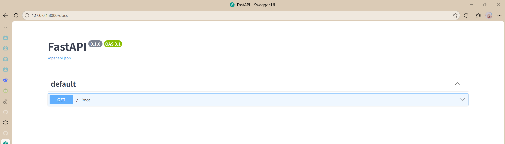

# FastAPI 从安装到 Hello World 实战避坑指南（无需 uv）

FastAPI 目前是 Python 后端开发最火热的框架之一。但很多新手在看官方文档或网上教程时，往往会被各种环境问题、命令行报错卡在第一步。

本文不讲深奥的异步原理，只从纯实战角度，带你从零开始，用最稳妥的 `pip + venv` 方式，把 FastAPI 跑起来，并复盘那些极易踩中的“深坑”。

#  第一步：环境准备与黄金法则

**1. 黄金法则：项目路径绝对不要带中文、空格和特殊符号！**
很多人一开始为了好记，把项目放在类似 `C:\Users\Kali\Desktop\CMDB + 自动化运维平台\` 的目录下。Python 3 对 Unicode 路径支持已经不错，但 Windows 下旧工具链、命令行编码、部分包仍可能出问题。建议纯英文无空格是稳妥实践。请务必使用**纯英文、无空格**的路径，如 `D:\Projects\fastapi-demo`。

**2. 创建并激活虚拟环境**
进入你的项目根目录（例如 `C:\Users\Kali\Desktop\Project\cmdb-ops\backend`，也就是你准备存放代码和 `requirements.txt` 的地方），打开终端：
```powershell
# 创建虚拟环境
python -m venv .venv

# Windows PowerShell 激活
.\.venv\Scripts\Activate.ps1

# macOS / Linux 激活
# source .venv/bin/activate
```
*注：如果 PowerShell 报错“禁止运行脚本”，请以管理员身份运行 PowerShell，执行 `Set-ExecutionPolicy -ExecutionPolicy RemoteSigned -Scope CurrentUser`，输入 Y 确认后重试。*
看到终端前出现 `(.venv)`，说明环境激活成功。

**3. Python 版本要求**
FastAPI 要求 Python 3.8+，但新项目建议直接用 **Python 3.11 及以上**（启动更快、类型提示支持更好）。先确认版本：
```powershell
python --version
```
低于 3.8 请先升级 Python。

**4. 配置 .gitignore（别把虚拟环境提交进 Git）**
`.venv` 和 `__pycache__` 动辄几百 MB，**绝不能提交**。在项目根目录新建 `.gitignore`：
```gitignore
# 虚拟环境
.venv/
venv/

# Python 缓存
__pycache__/
*.py[cod]

# 敏感配置
.env
```

###  第二步：依赖管理与安装

官方文档现在主推 `uv` 工具，导致很多新手以为 `uv` 是必须的。**实际上，`uv` 只是一个包管理器，完全不装也能开发。**

在开始安装前，必须澄清两个极易混淆的概念：
*   **`uvicorn`**：ASGI 服务器，**必须要有**，用来运行 FastAPI 应用。
*   **`uv`**：包管理工具，**非必须**，我们用 `pip` 就足够了。

**1. 什么是 `requirements.txt`？**
在真实的 Python 项目中，我们不会依赖大脑去记“这个项目装了什么包”。`requirements.txt` 就是项目的“依赖清单”（类似于前端项目的 `package.json`），它记录了项目运行所需的所有 Python 包及版本。只要有了它，无论是在你的另一台电脑，还是部署到服务器上，一条命令就能还原出一模一样的运行环境。

**2. 编写 `requirements.txt`**
在你的项目根目录下（与 `main.py` 同级，或者你的 `backend` 目录下），新建一个名为 `requirements.txt` 的文本文件，填入以下内容：
```text
fastapi[standard]
```
*注：`fastapi[standard]` 会自动包含 FastAPI 核心库以及 `uvicorn` 等标准依赖，省去单独安装的麻烦。实战中为防止未来更新导致接口报错，建议锁定版本，例如写成 `fastapi[standard]==0.115.0`*

**3. 根据依赖清单安装**
确保你的终端已经激活了虚拟环境（前面有 `(.venv)`），并且**当前终端的路径确实在这个 `requirements.txt` 文件所在的目录下**。执行：
```powershell
pip install -r requirements.txt
```
*这个 `-r` 参数就是告诉 pip：请读取这个文件，并一次性把里面写的所有包都装好。*

*补充 1：首次建议先升级 pip（旧版 pip 装新包容易报奇怪的解析错误）：*
```powershell
python -m pip install --upgrade pip
```

*补充 2：下载慢或超时？换国内镜像源（清华源）再装：*
```powershell
pip install -r requirements.txt -i https://pypi.tuna.tsinghua.edu.cn/simple
```

> ⚠️ **实战常见坑位预警**：
> 如果你在父目录执行这个命令，报错 `ERROR: Could not open requirements file: [Errno 2] No such file or directory: 'requirements.txt'`，不要慌，这纯粹是**路径没对上**。你的终端在 `cmdb-ops`，但文件在 `backend`。先 `cd backend`，再执行即可。

**4. 快速验证安装**
安装完成后，用一行 Python 代码快速确认：
```powershell
python -c "import fastapi; print(fastapi.__version__)"
```
如果能正常打印出版本号（如 `0.115.0`），说明依赖已完美就位。

*(补充：如果你只是想临时快速测试一下，也可以跳过 `requirements.txt`，直接执行 `pip install "fastapi[standard]"`。但在正规项目里，千万别忘了把包装进 `requirements.txt`。)*

##  第三步：编写你的第一个 Hello World

在项目目录下新建 `main.py`（或 `app/main.py`）：
```python
# 从 fastapi 包中导入 FastAPI 类（它是构建应用的核心）
from fastapi import FastAPI

# 实例化 FastAPI 应用对象。
# 这个 app 变量就是整个 Web 应用的核心入口，后续所有的路由、配置都挂载在它上面。
app = FastAPI()

# 装饰器：将下面定义的 root 函数注册到路由表中。
# @app.get("/") 表示当客户端发起 HTTP GET 请求，且访问的路径是 "/"（根路径）时，交给这个函数处理。
@app.get("/")
# 定义路由处理函数。使用 async def 声明为异步函数，这是 FastAPI 推荐的写法。
# 好处是：当处理耗时操作（如查数据库、请求外部接口）时，FastAPI 可以自动切换去处理其他请求，提高并发性能。
async def root():
    # 函数返回一个 Python 字典。
    # FastAPI 会自动将这个字典转换为 JSON 格式（Content-Type: application/json）作为 HTTP 响应体返回给前端。
    return {"message": "Hello World"}
```

## 第四步：启动服务（正确姿势）

**❌ 常见错误 1：`python main.py`**
`main.py` 只是一个定义文件，没有启动服务器的代码，直接运行会报 `ModuleNotFoundError` 或者毫无反应。

**❌ 常见错误 2： `run fastapi dev`**
这是官方文档用 `uv` 工具时的简写命令。如果你没有安装 `uv`，直接敲这些命令，PowerShell 会无情地报错：`无法将“run”项识别为 cmdlet...`。

**✅ 正确命令：`uvicorn 文件名:实例名 --reload`**
在终端执行：
```powershell
uvicorn main:app --reload
```
*   `main`：你的 Python 文件名（不带 `.py`）。
*   `app`：你在代码里 `app = FastAPI()` 中的变量名。
*   `--reload`：开发模式，代码保存后自动重启。

如果代码在 `app/main.py` 中，启动命令则为：
```powershell
uvicorn app.main:app --reload
```

**补充 1：`uvicorn` 命令找不到？用 `python -m uvicorn` 兜底**
如果明明激活了虚拟环境，还是报 `uvicorn 不是内部或外部命令`，多半是 PATH 没刷新。用模块方式启动最稳，它会强制用当前虚拟环境的 Python 去找 uvicorn：
```powershell
python -m uvicorn app.main:app --reload
```

**补充 2：端口被占用怎么办**
启动报 `[Errno 10048] ... only one usage of each socket address`，说明 8000 端口被占了。两种办法：
- 换端口：`uvicorn app.main:app --reload --port 8001`
- 查是谁占的：`netstat -ano | findstr :8000`，记下 PID 再用 `taskkill /F /PID <PID>` 结束它

**补充 3：`--host` 与 `--reload` 的适用场景（重要）**
- `--reload`：**只用于开发**。生产环境（正式部署）绝不能用——它会持续监视文件变化，有性能开销，且不适合多进程部署。
- `--host 0.0.0.0`：默认只监听 `127.0.0.1`（仅本机能访问）。要让局域网其他机器或服务器外网访问，需加：
```powershell
uvicorn app.main:app --host 0.0.0.0 --port 8000
```

##  第五步：验证成果

服务启动后，终端会显示 `Uvicorn running on http://127.0.0.1:8000`。

打开浏览器：
1.  访问 `http://127.0.0.1:8000` -> 看到 `{"message":"Hello World"}`。

1.  访问 `http://127.0.0.1:8000/docs` -> 这是 FastAPI 最强大的武器，自动生成的交互式文档（Swagger UI），你可以直接在这里测试接口！

##  第六步：实战血泪踩坑复盘（极度重要）

回顾整个安装过程，以下三个坑几乎每个新手都会踩，务必牢记：

1.  **路径错乱导致的“找不到文件”**
    *   **现象**：执行 `pip install -r requirements.txt` 报错 `No such file or directory`。
    *   **原因**：文件在 `backend` 目录下，但终端还停留在外层目录 `cmdb-ops`。
    *   **解决**：先 `cd backend` 进入文件所在目录，再执行安装。推荐使用 `Get-ChildItem -Recurse -Filter requirements.txt` 先确认文件位置。
2.  **移动/重命名项目目录导致的“虚拟环境损坏”**
    *   **现象**：报错 `Fatal error in launcher: Unable to create process using...` 甚至出现 `??????` 乱码。
    *   **原因**：虚拟环境 `.venv` 中的 `pip.exe` 等启动器在创建时，把当时的绝对路径写死了。一旦你改了文件夹名字，它就找不到原来的自己了。
    *   **解决**：不要试图修复。直接删除 `.venv` 文件夹（`Remove-Item -Recurse -Force .venv`），然后在新的纯净路径下重新创建、激活、安装依赖。1 分钟搞定，比修毛病快。
3.  **混淆 `uvicorn` 和 `uv`**
    *   **现象**：终端报 `无法将“run”项识别为 cmdlet` 或 `uvicorn 不是内部或外部命令`。
    *   **解决**：不要盲目复制官方文档的 `uv run fastapi dev`。确定你处于 `(.venv)` 激活状态下，老老实实敲 `uvicorn app.main:app --reload`。


## 总结
历经一番磨难，终于把Fast API跑起来了，最后，总结一下整体的操作流程。
```
进入正确目录 -> 激活 .venv -> pip install -r requirements.txt -> uvicorn app.main:app --reload -> 去 /docs 测试
```

记住每天的固定开发动作：
`激活 .venv` -> `uvicorn app.main:app --reload` -> `写代码` -> `去 /docs 测试` -> `Ctrl+C 结束`。

