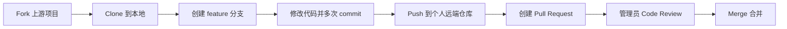

# Git学习实战篇——Git与GitHub从零到一完整演练

> 本文是理论篇的实战延续，所有操作均可借助Claude AI Agent辅助完成。从环境搭建到PR合并，全流程覆盖。

---
## 一、😊工具准备
### 第一步：安装Git（Windows / macOS）

**Windows环境**：

**方法一：**
1. 访问Git官网下载页面：https://git-scm.com/download/win
2. 下载`.exe`安装包（64位版本）
3. 运行安装程序，一路保持默认选项（建议将"默认编辑器"选为VS Code）
4. 安装完成后，在任意文件夹右键选择**Git Bash Here**，输入`git --version`，显示版本号则成功

**方法二：**
*   **使用 `winget` 安装 (推荐)**：在“命令提示符”或“PowerShell”中运行：
    ```bash
    winget install --id Git.Git -e --source winget
    ```

**macOS环境**：
- 方法一（推荐）：打开终端，执行`xcode-select --install`安装Xcode Command Line Tools（内置Git）
- 方法二：使用Homebrew执行`brew install git`
- 验证：终端输入`git --version`

---

## 第二步：安装VS Code及必备插件

1. 访问 https://code.visualstudio.com/ 下载安装VS Code
2. 启动VS Code，点击左侧扩展图标（或按`Ctrl+Shift+X` / `Cmd+Shift+X`）
3. 搜索安装以下插件：
   - **GitLens** —— 增强Git历史查看与Blame信息
   - **GitHub Pull Requests** —— 在VS Code内管理PR

---

## 第三步：注册GitHub账号并配置SSH密钥

1. 访问 https://github.com/ 注册账号
2. 生成SSH密钥（免密推送）：
   ```bash
   ssh-keygen -t ed25519 -C "your_email@example.com"
   ```
   一路回车（默认路径，不设密码）
3. 复制公钥内容：
   ```bash
   cat ~/.ssh/id_ed25519.pub
   ```
4. 登录GitHub → 右上角头像 → **Settings** → **SSH and GPG keys** → **New SSH Key**，粘贴保存

---

## 第四步：初始化Git全局配置

在终端执行以下命令（替换为你的GitHub用户名和邮箱）：

```bash
git config --global user.name "你的GitHub用户名"
git config --global user.email "你的GitHub邮箱"
git config --global color.ui auto  # 启用命令行颜色高亮
```

验证配置：`git config --list`

---

## 第五步：初始化第一个Git仓库并进行首次提交

1. 新建文件夹（如`my-first-repo`），在VS Code中打开
2. 按`Ctrl+Shift+P`（Mac: `Cmd+Shift+P`），输入`Git: Initialize Repository`，选择当前文件夹
3. 新建文件`index.html`，写入`<h1>Hello Git</h1>`
4. 点击左侧**Source Control**图标（或按`Ctrl+Shift+G` / `Cmd+Shift+G`）
5. 在"消息"框中输入`首次提交`，点击**Commit**按钮（VS Code自动执行`add` + `commit`）

---

## 第六步：在GitHub创建远程仓库并推送

1. 登录GitHub，点击右上角`+` → **New repository**
2. 仓库名填写`my-first-repo`，选择**Public**，**不勾选**"Add a README file"
3. 点击**Create repository**
4. 复制推送命令（推荐SSH）：
   ```bash
   git remote add origin git@github.com:你的用户名/my-first-repo.git
   git branch -M main
   git push -u origin main
   ```
5. 在VS Code终端中执行
6. 刷新GitHub页面，即可看到上传的文件

---

## 二、🤏多场景实战
### 1、实战分支操作

**在终端中执行以下命令序列**：

```bash
# 1. 创建并切换分支
git checkout -b feature/hello

# 2. 修改文件并提交
# （手动修改index.html内容为 <h1>Hello from Feature</h1>）
git add index.html
git commit -m "修改首页标题"

# 3. 切回主干
git checkout main

# 4. 合并分支
git merge feature/hello

# 5. 删除分支
git branch -d feature/hello
```

---

## 2、模拟多人协作——Fork与PR实战

### 标准开源贡献流程



1. **Fork**：进入目标仓库，点击右上角**Fork**按钮
2. **Clone**：在VS Code中按`Ctrl+Shift+P` → `Git: Clone`，粘贴Fork后的仓库URL
3. **创建分支并修改**：
   ```bash
   git checkout -b fix-typo
   # 修改README.md
   git add README.md
   git commit -m "修正拼写错误"
   git push origin fix-typo
   ```
4. **创建PR**：打开GitHub上你的Fork仓库 → **Pull requests** → **New pull request**，选择`fix-typo` → `main`，填写标题，点击创建

---

## 3、冲突场景模拟与解决

**场景**：两个分支修改同一文件同一行

1. 在main分支修改`fruit.txt`第一行为`apple`并提交
2. 在feature分支修改同一文件第一行为`banana`并提交
3. 执行合并：`git merge feature`
4. Git提示冲突，需手动解决。打开冲突文件，保留需要的内容
5. 标记冲突已解决并完成合并：
   ```bash
   git add fruit.txt
   git commit -m "解决fruit.txt冲突"
   ```

---

## 4、高级操作速查

### 撤销操作对比

| 操作 | 适用场景 | 命令 |
|------|----------|------|
| **Discard** | 放弃未commit的本地修改 | `git checkout -- <文件名>` |
| **Soft Reset** | 撤销commit，保留修改到暂存区 | `git reset --soft HEAD~1` |
| **Hard Reset** | 彻底撤销commit，丢弃所有修改（危险） | `git reset --hard HEAD~1` |
| **Revert** | 安全撤销已推送的提交（新增反向提交） | `git revert <commit-id>` |

### 暂存未完成工作

```bash
git stash        # 暂存当前改动
git stash pop    # 恢复暂存内容
```

### Cherry-pick选择性合并

```bash
git cherry-pick <commit-id-1> <commit-id-2>
```

---


## 三、**📌 划重点：**
整篇下来，如果你是纯新手，记住这三步就够了：

- 装好 Git + VS Code + GitLens（跟着第一步走完）

- 学会 add → commit → push（第五、六步）

- 遇到冲突别慌，按第四节的流程慢慢解，实在不行就 Ctrl+Z 重来。

剩下的分支、PR、Cherry-pick，都是你熟练之后"顺便学的"，不用一次性全啃完。Git 这东西，用着用着就会了，不是学会了才用。


