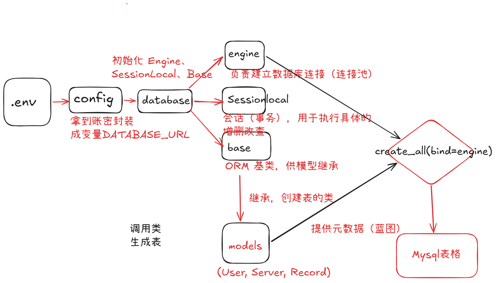

FastAPI 的 Hello World 跑通之后，真正项目的第二步就是接数据库。本文不讲 ORM 的深奥理论，只从纯实战角度，带你用 `SQLAlchemy + pymysql` 连上 MySQL 8.4，建出「用户、服务器、执行记录」三张表，并复盘那些极易踩中的深坑。

> 📌 **说明**：本文的 MySQL 安装与初始化，**全程由 AI Agent（编程智能体）通过命令行完成**。现实中装 MySQL 只有两条合理路径：① 官网**图形安装器**点几下（全自动）；② **全权交给 Agent**。没有人会手动敲初始化命令。下面记录的是 Agent 当时的实际执行过程，仅供了解原理或排查问题，**不是让你照做的手动教程**。

## 第一步：安装 MySQL（这一步是 Agent 做的）

Agent 因为只能敲命令、点不了图形界面，所以它执行的是：

```powershell
winget install --id Oracle.MySQL --accept-package-agreements --accept-source-agreements --silent
```

**如果你是自己装，首选官方图形安装器**：官网下载 MSI → 双击 → 一路下一步，初始化、设密码、建服务**全自动完成**，根本不用碰命令行。

## 第二步：初始化（Agent 补做的步骤，人不会手动做）

winget 是**静默安装**，不运行图形配置向导，所以 Agent 才手动补了初始化四步：

1. 建数据目录 + 写 `my.ini`（配置端口 3306、utf8mb4 编码）
2. 初始化数据：`mysqld --initialize-insecure`（root 空密码）
3. 注册服务：`mysqld --install MySQL84`
4. 启动：`net start MySQL84`

> 💡 **强调：这一步只有静默安装才需要。** 你用图形安装器的话，向导自动完成这四步，永远不用碰这些命令。这里记录下来，只是为了了解原理、以及将来出问题时能排查。

## 第三步：用 DBeaver 连接、设密码、建库

图形化客户端推荐免费的 **DBeaver Community**（DataGrip 是收费的，新手不推荐）。

连接信息：

```
Host: localhost    Port: 3306    User: root    Password: (空)
```

连上后执行两句 SQL：

```sql
-- 1. 设 root 密码
ALTER USER 'root'@'localhost' IDENTIFIED BY '你的密码';

-- 2. 建库
CREATE DATABASE cmdb_ops DEFAULT CHARACTER SET utf8mb4 COLLATE utf8mb4_general_ci;
```

## 第四步：先搞懂连接链路（比代码更重要）

写代码前，先明白谁连谁：

```
.env（密码+地址）
  → config.py（读出来，拼成 DATABASE_URL）
  → database.py（造出 engine / session / base 三个工具）
  → models/*.py（用 base 定义三张表）
  → main.py（启动时喊 create_all 建表）
  → MySQL（表落地）
```
可以看下图：

**关键认知：SQLAlchemy 不直接连数据库，它调用 pymysql 去连。** 类比 Java：SQLAlchemy ≈ Hibernate，pymysql ≈ JDBC。

## 第五步：写 config.py（读 .env）

只用两个函数：`load_dotenv()`（把 .env 读进环境变量）+ `os.getenv()`（取出来）。这两个函数需要导入配置模块`os`和`dotenv`。

这里需要注意的是getenv函数，默认是传入一个环境变量和默认值（找不到环境变量时传出的值），默认值最好不要写，后期报错很难处理。这里推荐fail-fast，缺失就立刻报清晰错误。

```python
DATABASE_URL = os.getenv("DATABASE_URL")
if not DATABASE_URL:
    raise ValueError("环境变量缺失: DATABASE_URL 未配置")
```

## 第六步：写 database.py（造三个工具）

三个对象在**模块顶层一次造好**

| 对象 | 是什么 |
| --- | --- |
| engine | 连接器，真正连数据库的 |
| SessionLocal | 会话工厂，生产「临时工作台」 |
| Base | 基类，模型继承它才被认作表 |
```Python
from sqlalchemy import create_engine
from sqlalchemy.orm import sessionmaker
from sqlalchemy.orm import declarative_base
import app.core.config
# 创建 SQLAlchemy 引擎
engine=create_engine(
    app.core.config.DATABASE_URL,
    pool_pre_ping=True
)
# 创建会话工厂
SessionLocal=sessionmaker(
    bind=engine,
    autocommit=False,
    autoflush=False,
    expire_on_commit=False
)
# 定义 Base 基类
Base=declarative_base()
```
## 第七步：写三个模型（user / server / record）
一个类 = 一张表。字段类型：`Integer` / `String(n)` / `DateTime` / `Text`。
Column 常用参数速查：

| 参数 | 含义 |
| --- | --- |
| primary_key=True | 主键，唯一标识一行 |
| unique=True | 值不能重复 |
| nullable=False | 不允许为空 |
| index=True | 建索引，查询更快 |
| default="..." | Python 层默认值 |
| server_default=func.now() | 数据库层默认值（自动填时间） |
| comment="..." | 字段注释 |
以user表为例：
```Python
from sqlalchemy import Column, Integer, String, DateTime
from sqlalchemy.sql import func
from app.core.database import Base
class User(Base):
    __tablename__ = "users"
    id = Column(Integer, primary_key=True, comment="主键ID")
    username = Column(String(50), unique=True, nullable=False, index=True, comment="用户名")
    password = Column(String(255), nullable=False, comment="密码")
    name = Column(String(50), comment="姓名")
    role = Column(String(20), default="普通运维", comment="角色")
    status = Column(String(20), default="启用", comment="状态")
    created_at = Column(DateTime, server_default=func.now(), comment="创建时间")
```

## 第八步：注册模型 + main.py 建表

**血泪坑：建表顺序。** SQLAlchemy 只认识「被导入过」的模型。必须：

```python
from app import models                        # 先导入，触发模型注册
from app.core.database import Base, engine
Base.metadata.create_all(bind=engine)         # 再建表
```
## 第九步：补齐requirements.txt 的依赖

需要四个依赖：

```text
sqlalchemy      # ORM
pymysql         # 驱动
cryptography    # ⚠️ 容易漏！pymysql 连 MySQL 8.4 认证必需
python-dotenv   # 读 .env
```
MySQL 8.4 默认认证插件是 `caching_sha2_password`，pymysql 需要 `cryptography` 包才能完成认证。漏了它会报 `cryptography package is required...`。
## 第十步：验证
```powershell
uvicorn app.main:app --reload
```
然后去 DBeaver 刷新，看到 `users` / `servers` / `records` 三张表 = 成功。
## 血泪踩坑复盘
1. **卸载 MySQL 不停服务**：卸载只删了程序文件（`Program Files`），但服务还在跑、数据目录（`ProgramData`）还在 → 僵尸进程占 3306 端口 → 停服务、杀进程、删服务、重装
2. **默认值 None**：改成 `raise ValueError`（fail-fast）
3. **漏掉 `cryptography`**：连不上 MySQL 8.4 的认证

## 总结

流程一句话：

```
装 MySQL → 初始化 → DBeaver 设密码建库 → config.py → database.py → 三个模型 → __init__.py → main.py 建表 → requirements.txt → commit + push
```


