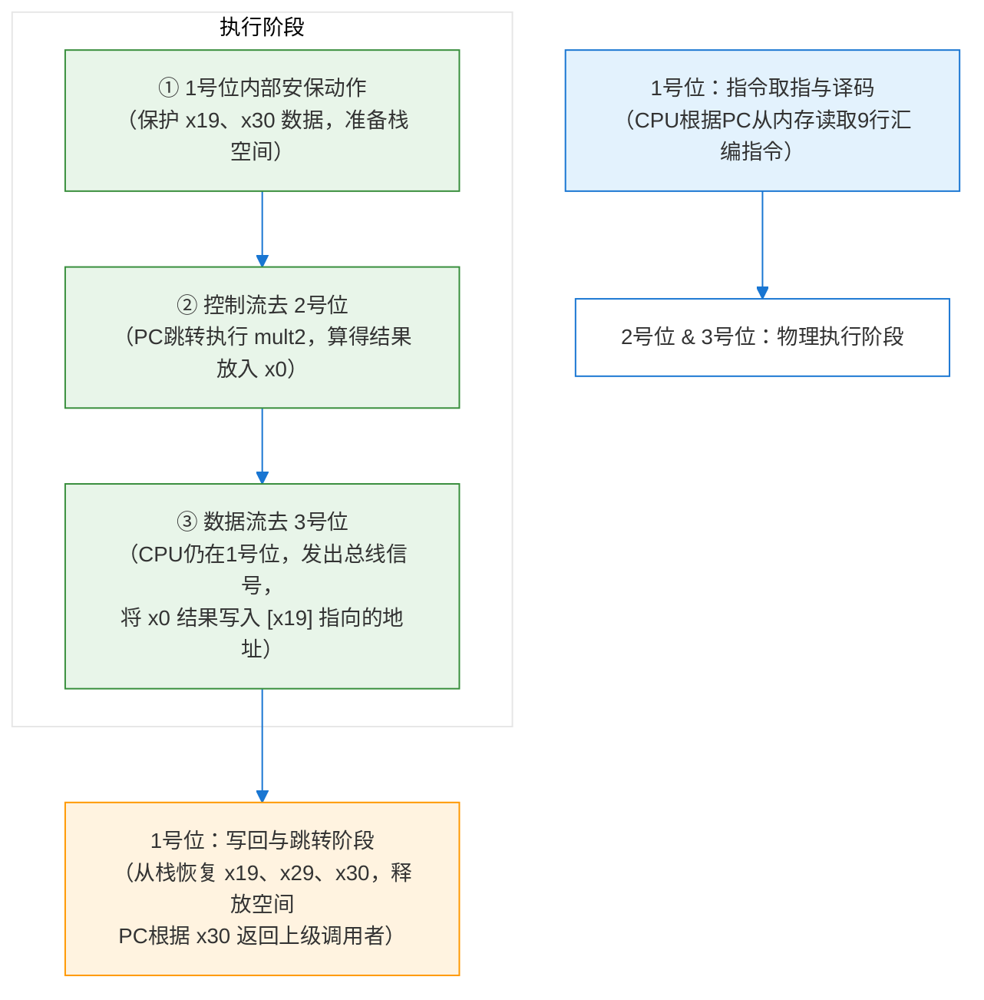

### 📍 1. 引言：我的懵逼时刻
事情要从最近做的一道题目说起，做这个题目的时候，我的状态大部分时候是处于蒙圈的，因为这个题目很绕，题目中的x29, x30, x19, sp等的符号真的理不清。题目代码如下：

```
//C code in mstore.c
long mult2(long, long);
void multstore(long x,long y, long *dest)
{
    long t = mult2(x, y);
    *dest = t;
}

//Assembly file in mstore.s
multstore:
    stp     x29, x30, [sp, -32]!
    mov     x29, sp
    str     x19, [sp, 16]
    mov     x19, x2
    bl      mult2
    str     x0, [x19]
    ldr     x19, [sp, 16]
    ldp     x29, x30, [sp], 32
    ret

//Binary code in mstore
fd 7b be a9 fd 03 00 91 f3
0b 00 f9 f3 03 02 aa f0 ff
ff 97 60 02 00 f9 f3
```
实话说，我没有什么汇编语言的基础，当时学习机组的时候，没怎么学，这下好了在操作系统，又来整我了。后来通过AI的辅助，这里AI也没给我讲清楚，但是也给我一点启发，也就有这篇文章了，希望对你有用。
### 📍 2. 核心武器：我的“三号理论”（物理坐标法）
我们现在简单讲一下这段代码的主要功能：实现实数X和Y的乘积，返回到*dest指针。
我们现在直入主题，逐行代码的讲解三号理论：

这张图里有三个位置和一个上级调用者，就是我们的三号理论的基地
其中一号是我们的老家，即栈空间，二号是实现乘法功能的位置，三号是乘法结果最终的位置
**第1行：`stp x29, x30, [sp, -32]!`**
*   **硬件动作**：栈指针 `sp` 减去32，空出空间。将寄存器 `x29`、`x30` 的旧值保存到这段新空出的栈内存中。
*   **三号对应**：**行动发生在 1号位的栈空间内**。这是为了服务本函数所建立的“保护现场”，把上级的底盘和回家的地图锁进本地抽屉。

**第2行：`mov x29, sp`**
*   **硬件动作**：将 `sp` 当前的值复制给 `x29`。
*   **三号对应**：**行动发生在 1号位（寄存器到寄存器）**。为 1号位的栈空间插下一根绝对位置不变的“标杆（帧指针）”，后续无论是存数据还是取数据，都以 `x29` 为基准定位。

**第3行：`str x19, [sp, 16]`**
*   **硬件动作**：将寄存器 `x19` 当前的旧值，保存到 1号位 栈空间偏移16字节的位置。
*   **三号对应**：**行动发生在 1号位的栈空间内**。因为即将要借用 `x19` 这个口袋，所以必须先把上一级留给 `x19` 的数据存起来，这叫“保护被调用者保存寄存器”。

**第4行：`mov x19, x2`**
*   **硬件动作**：将寄存器 `x2` 的值（目标地址 `dest`）复制给寄存器 `x19`。
*   **三号对应**：**行动发生在 1号位（寄存器到寄存器）**。此刻 `x19` 里装的不再是旧数据，而是 **3号位（数据最终落脚点）的物理内存地址**。

**第5行：`bl mult2`**
*   **硬件动作**：先将下一条指令的地址写入 `x30` 寄存器，然后将 PC（程序计数器）指针强制修改为 `mult2` 的起始地址。
*   **三号对应**：**控制流离开 1号位，物理跳转到 2号位的代码区**。CPU 在 2号位 执行乘法，算完后将结果放入 `x0`。因为记下了 `x30` 的地址，CPU 会自动**跳回 1号位 的下一行**。

**第6行：`str x0, [x19]`**
*   **硬件动作**：将寄存器 `x0` 的值（乘法结果），写入到内存地址 `[x19]` 指向的位置。
*   **三号对应（重点纠正过去混淆的地方）**：**指令在 1号位的代码区执行，但通过数据总线把结果送进了 3号位。** CPU 根本没有“走到” 3号位。它只是站在 1号位，发出了一个“写内存”的物理信号，把数据直接搬运到了 `x19` 对应的内存格子里。**（C语言 `*dest = t;` 此刻在物理上落地）。**

**第7行：`ldr x19, [sp, 16]`**
*   **硬件动作**：从 1号位栈空间偏移16的位置，把数据取回到寄存器 `x19`。
*   **三号对应**：**行动发生在 1号位的栈空间**。送货工作已完成，把第3步存进去的“上一级旧数据”从栈里拿回来，还给 `x19` 寄存器（原物奉还）。

**第8行：`ldp x29, x30, [sp], 32`**
*   **硬件动作**：从栈顶弹出最开始保存的 `x29` 和 `x30` 原值，并将栈指针 `sp` 加回32（销毁刚刚开辟的本地栈空间）。
*   **三号对应**：**行动发生在 1号位的栈空间**。把锁在 1号位抽屉里的地图和基准取回来，并将 1号位这个临时搭建的“工作台”彻底撤销。

**第9行：`ret`**
*   **硬件动作**：将寄存器 `x30` 里的“返回地址”赋值给 PC 指针。
*   **三号对应**：**彻底离开 1号位的代码区，回到上级调用者**。程序控制权被完整地交还给最初调用 `multstore` 的地方。


### 📍 3. 宏观动态推演（地图实战）

结合三号理论和9行汇编指令，我们可以把这套繁琐的物理动作，归纳为**五个严密的执行阶段**，全程都在我们的“三号地图”上跑：

- 🟢 阶段一：铺摊子（对应第1-2行）
在内存栈里划出 32 字节的专属空间。把上一级边界（x29）和最终回家路线（x30）锁进本地栈空间。立下 x29 这根固定标杆，划定1号位的活动范围。

- 🔵 阶段二：保护数据，预存地址（对应第3-4行）
为了防止 x19 里的旧数据丢失，先把它存进栈里。腾出口袋后，把3号位的终极地址抄进 x19 中。

- 🔴 阶段三：调兵算数（对应第5行）
通过 bl 指令，PC 指针离开 1号位，跳转到 2号位。mult2 算完结果放回 x0，依靠 x30 的标记，CPU 无缝跳回 1号位。

- 🟣 阶段四：终极执行（对应第6行）
CPU 仍在 1号位，发出写内存信号。借助 x19 里的目标地址，将 x0 里的乘法结果通过数据总线，物理搬运进 3号位的格子（*dest = t;）。

- 🔴 阶段五：扫尾回家（对应第7-9行）
取回栈里的旧数据还给 x19，取出 x29 和 x30，撤销 1号位的操作台。最后执行 ret，彻底退出 1号位，回到上级调用者。

### 📍 4. 醍醐灌顶：为什么代码会这么“绕”？

看完上面的推演，你可能会觉得：“为了算个乘法和存个结果，做了这么多杂七杂八的安保动作，这也太麻烦了吧！”

**核心事实在于：**
上面这 9 行汇编代码里，**真正在完成 C 语言核心任务（算乘法和存结果）的，只有 2 行（`bl mult2` 和 `str x0, [x19]`）。** 剩下的 7 行，全都是为了保障“函数调用机制”能够稳定运行而被迫执行的**安保工序**。

这背后的底层规矩，叫做 **“ARM AAPCS64 函数调用约定”**。

*   **为什么死磕 `x19` 的安保？**
    在 ARM 64 位架构里，寄存器被明确分成了两类。`x0` 到 `x7` 是“**临时工**”，谁调用下一个函数，下一个函数都可以随便覆盖它们，你不用对它们的原始数据负责。但是，**`x19` 到 `x28` 是“专属特等座”**，遵循**“谁借用，谁恢复”**的铁律。只要你在函数里使用了这些寄存器（比如 `x19`），你就必须保证这个函数结束后，`x19` 的值和刚进来时一模一样。这就是为什么必须要有 `str x19`（存旧）和 `ldr x19`（取旧）这两个来回倒腾的动作。

*   **为什么需要 `x29` 和 `x30` 的复杂配合？**
    *   **`x30`（链接寄存器）**：解决了“**控制流去哪**”的问题。跳去 2号位 之前记下 1号位 的地址，算完能无缝回来。
    *   **`x29`（帧指针）**：解决了“**本地空间从哪开始**”的问题。因为 `sp` 在函数执行中会频繁上下移动，有了 `x29` 这根“标杆”，无论 `sp` 怎么跑，程序永远能找到 1号位栈空间里存放的那些安保数据。

---

### 📍 5. 总结：一张图看懂冯·诺依曼的执行

你的“三号理论”不仅成功破解了这段汇编代码，它其实刚好完美对应了经典**冯·诺依曼计算机体系结构**的物理执行本质：

1.  **取指与译码（控制单元）**：CPU 根据 PC 寄存器，从内存（1号位代码区）不断取出 9 行汇编指令并翻译。
2.  **执行阶段（运算与访存）**：通过 ALU（运算器）在 1号位 寄存器和栈之间完成数据保护、寄存器的变更，然后**控制流**去 2号位 算乘法，最后通过**数据总线**把结果物理搬运进 3号位的最终内存格子里。
3.  **写回与跳转**：计算完毕，把保护现场阶段所有锁进栈的旧数据写回寄存器，释放栈空间，PC 指针根据 `x30` 跳回上级调用者。



### 😊6.最后的话
看到这里，你有看懂我的三号理论吗？我觉得应该是比较清晰的吧。在我看来，所谓的函数调用就是把数据搬来搬去和寄存器保护，只要了解数据的搬运过程和寄存器保护，就不太需要去看那些枯燥乏味的汇编语言了，最后希望我的三号理论能帮你更好理解底层的函数调用。


